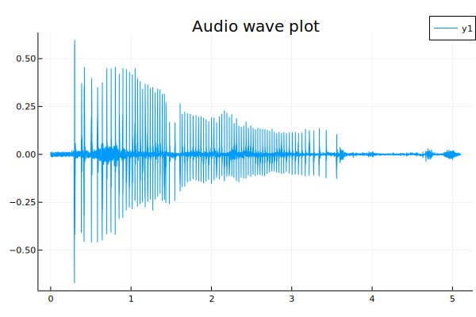
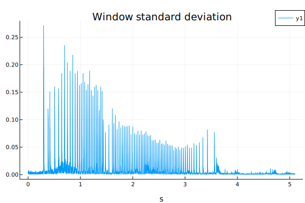
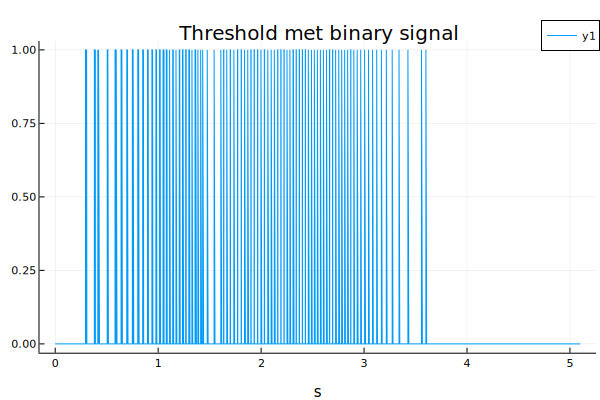
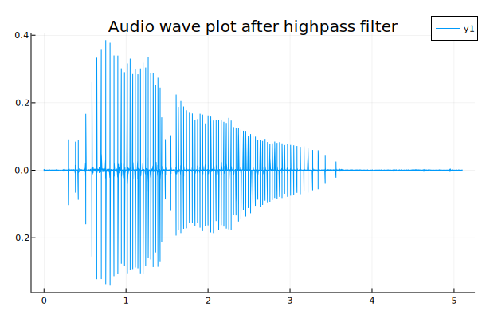
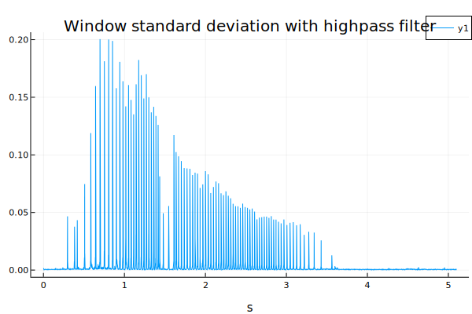
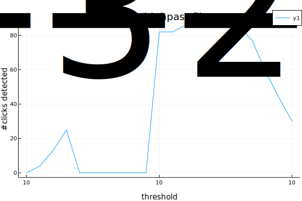
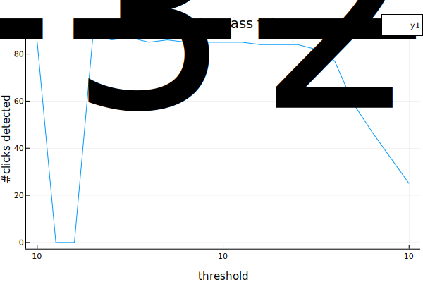
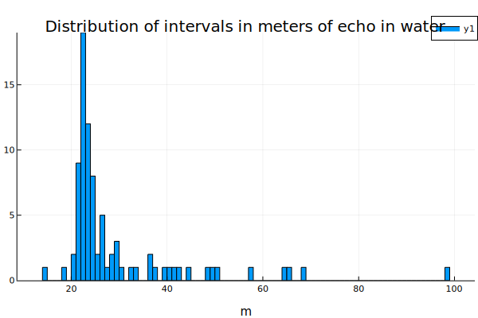
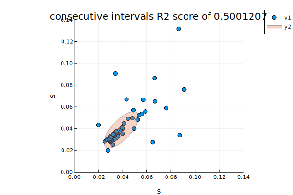

# Quick demonstration

I wanted to show what data analysis looks like with Julia, so made a quick analysis with detecting clicks.

I took the Sperm whales codas creaks from sound cloud, and cut the last 5 seconds of clicks out of it - with full length it would be cumbersome to plot everything.

You can read through the file, and reference plots here.

### Plot 1

### Plot 2

### Plot 3

### Plot 4

### Plot 5

### Plot 6

### Plot 7

### Screenshot 1

### Plot 8

### Plot 9

